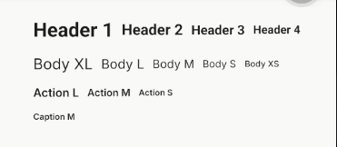
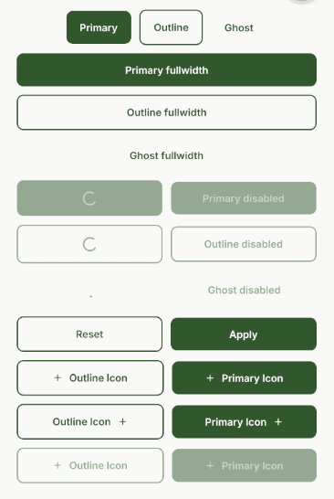
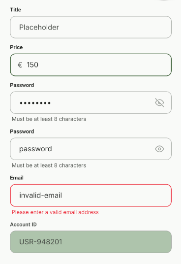
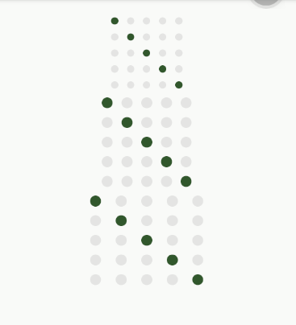
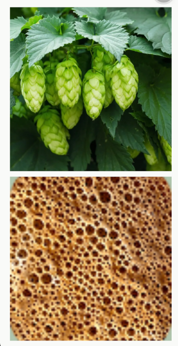
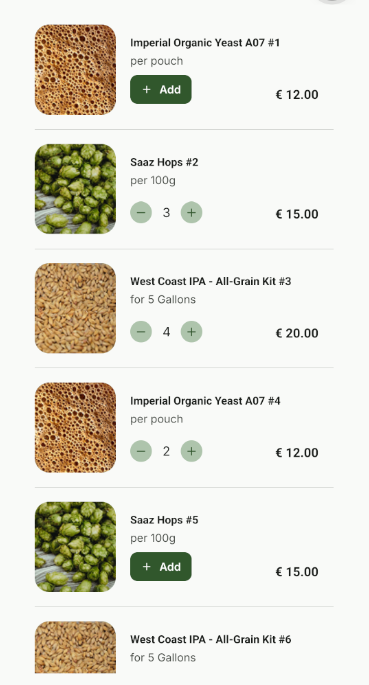

# Components examples

Table of Contents

- [Components examples](#components-examples)
  - [ThemedText](#themedtext)
  - [ThemedButton](#themedbutton)
  - [ThemedInput](#themedinput)
  - [ThemedLink](#themedlink)
  - [PaginationDots](#paginationdots)
  - [ThemedImage](#themedimage)
  - [ProductList](#productlist)

## ThemedText

A component for displaying themed text.

[Source code](/src/components/ui/themed-text.tsx)

## ThemedButton

A component for displaying themed buttons.

[Source code](/src/components/ui/themed-button.tsx)

## ThemedInput

A component for displaying themed input fields.

[Source code](/src/components/ui/themed-input.tsx)

## ThemedLink

A component for displaying themed links.

[Source code](/src/components/ui/themed-link.tsx)

## PaginationDots

A component for displaying pagination dots.

[Source code](/src/components/ui/pagination-dots.tsx)

## ThemedImage

A component for displaying images with loading states.

[Source code](/src/components/ui/themed-image.tsx)

## ProductList

A components for displaying products cards and a list of products.

[ProductList](/src/components/features/catalog/product-list.tsx)
[ProductCard](/src/components/features/catalog/product-card.tsx)
[ThemedCounter](/src/components/ui/themed-counter.tsx) [Divider](/src/components/ui/divider.tsx)

