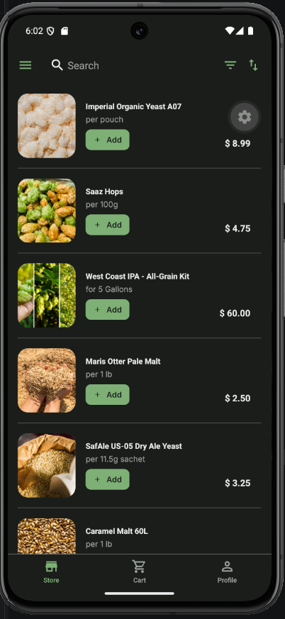
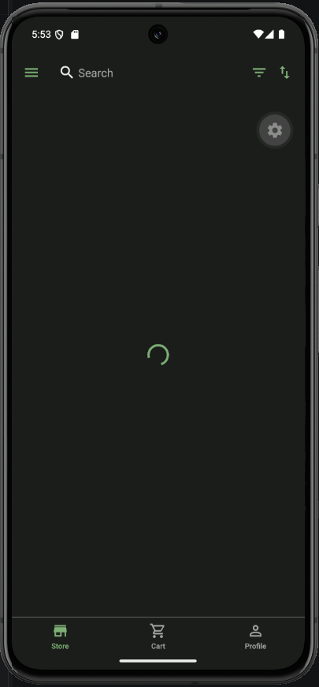
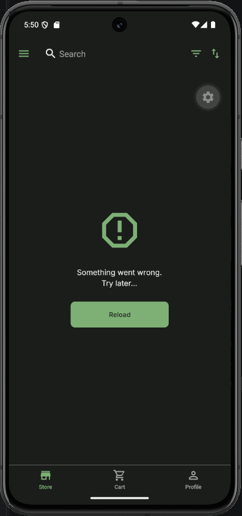
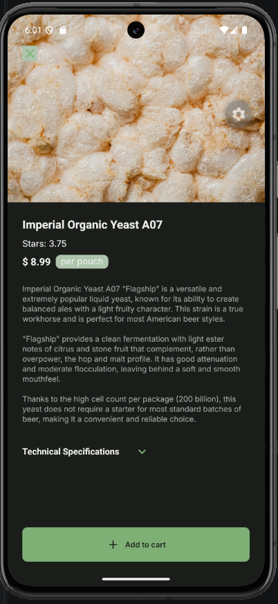
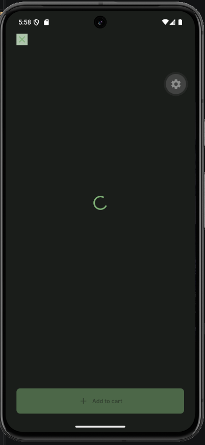
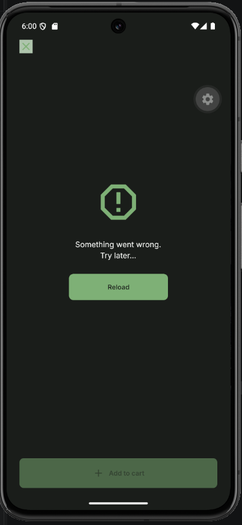

# Cross Assignment 5

## Fetch API data from the server (Axios) (sources)

[Store Service](/src/api/store-service.ts) [useProducts](/src/hooks/use-products.ts)
[useProductDetails](/src/hooks/use-product-details.ts)

## Show data in the UI (sources)

[Store View](/src/components/features/store/store-view.tsx)
[Product List](/src/components/features/catalog/product-list.tsx)
[Product Card](/src/components/features/catalog/product-card.tsx)

[Product Details View](/src/components/features/modals/product-details-view.tsx)
[Product Details Card](/src/components/features/catalog/product-details-card.tsx)

## Screen Shots

