# Final Project

## Overview

As part of the final development phase, the **Hop&Barley** mobile application underwent
comprehensive modernization aimed at driving user engagement, refining the overall user experience
(UX), and establishing a scalable, robust architecture. The updates encompass five essential
modules:

1. **Recipes:** Introduced an entirely new beer recipes module featuring one-click ingredient
   imports directly into the shopping cart to boost purchasing intent.
2. **Onboarding:** Integrated smooth horizontal gesture navigation (swipes) and persistent state
   caching for a frictionless first-time user experience.
3. **Authentication:** Strengthened account protection with OTP verification and enhanced visual
   feedback via informative toast alerts and dedicated loading states.
4. **Store (Product Catalog):** Refactored state management using Redux Toolkit, introducing
   full-text search, multi-criteria filtering, versatile sorting, and optimized dynamic pagination.
5. **Cart:** Re-architected business logic using custom React hooks, integrated a global TabBar
   count badge, and added instant feedback toasts for cart interactions.

[Presentation](./cross_final_project_presentation.pdf)

---

## Video

[Watch on YouTube](https://youtu.be/A_7nUSiZgLQ)

## Recipes

To attract new users and expand the application's capabilities, a new beer recipes section has been
implemented with flexible integration into the product catalog:

- **Recipe Catalog with Direct Cart Integration:** A comprehensive list of detailed recipes allowing
  users to add all necessary ingredients directly to the cart with a single click.
- **Search and Filtering:** Fast recipe search by title and filtering options based on preparation
  difficulty level.
- **Sorting:** Ability to sort recipes by rating and alphabetically by name.
- **Navigation Optimization:** The section is integrated directly into the primary TabBar, while the
  user profile has been relocated to the Drawer menu to reduce navigation clutter.
- **Backend Integration:** Data layer built with RTK Query, providing automated caching and
  optimized asynchronous requests to a mocked API (MockAPI.io).

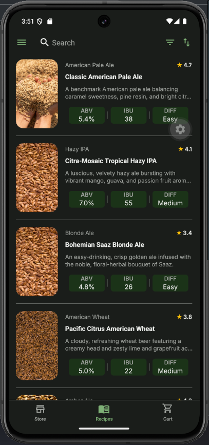
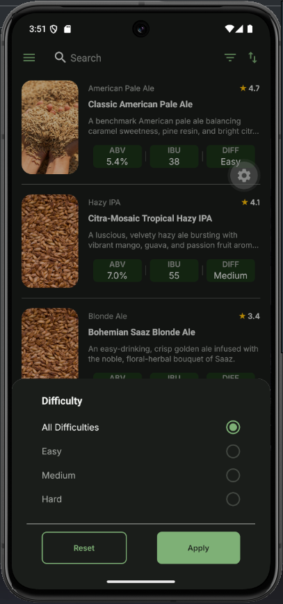
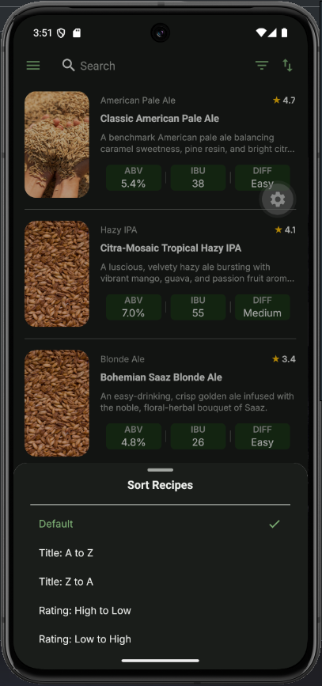 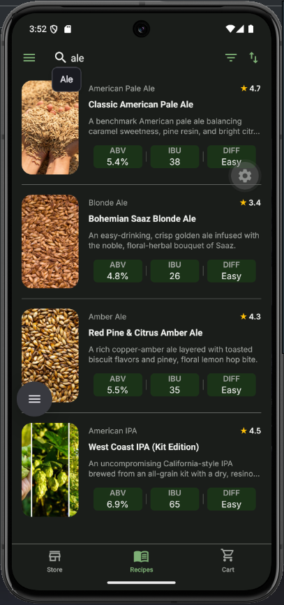
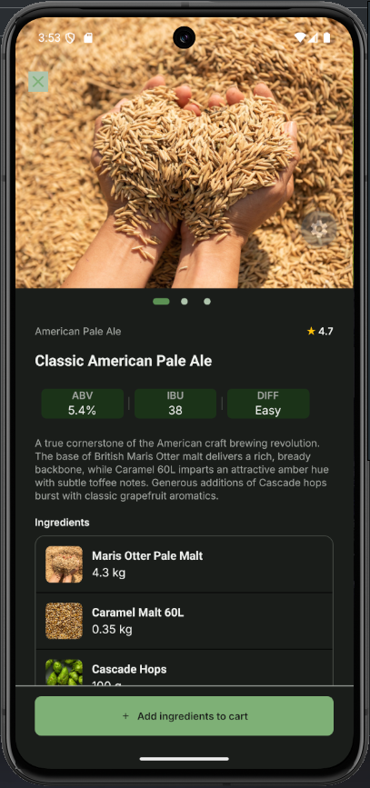 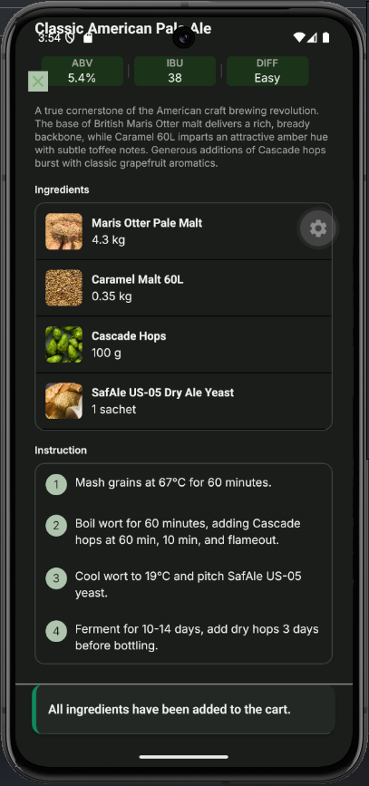

---

## Onboarding

The initial onboarding flow was redesigned to deliver a smooth and modern user experience:

- **Swipe and Gesture Controls:** Slide transitions implemented using native horizontal swipe
  gestures (left and right).
- **Persistent State (AsyncStorage):** Onboarding completion status is stored locally, ensuring the
  welcome flow is automatically skipped on subsequent launches.
- **Interface Responsiveness:** Guaranteed proper layout behavior and component rendering in
  landscape orientation.

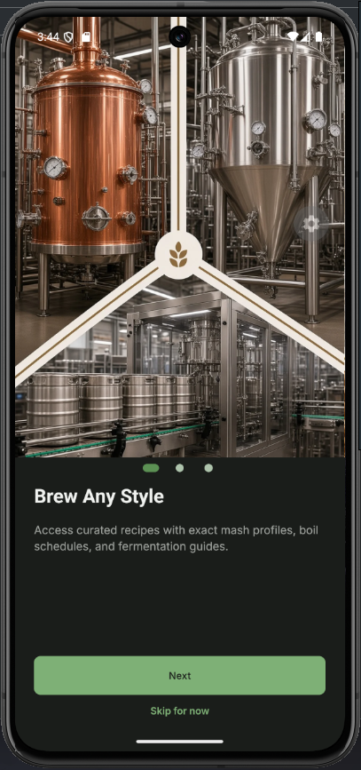 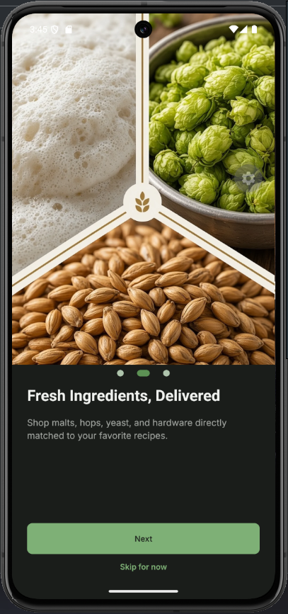
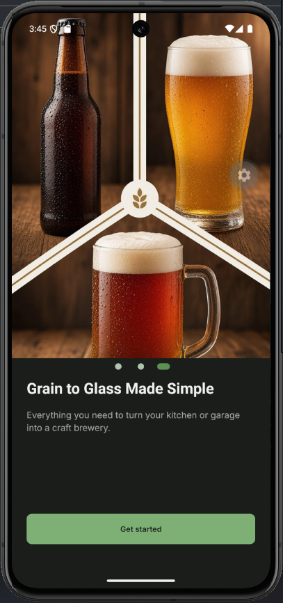

---

## Authentication

User security and clear feedback during authentication were the primary priorities in this module:

- **Informative Notifications (Toasts):** An integrated alert system providing feedback for key
  actions: successful sign-up, login, logout, password recovery, and detailed error messages for
  validation or network issues.
- **Loading States (Loaders):** Visual indicators added across all asynchronous server requests to
  keep the UI responsive and clearly signal background processing.
- **Password Recovery Confirmation:** A dedicated post-recovery screen confirming that instructions
  have been dispatched to the user's email address.
- **Two-Factor Verification:** OTP (One-Time Password) code verification implemented during
  registration to significantly enhance account security.

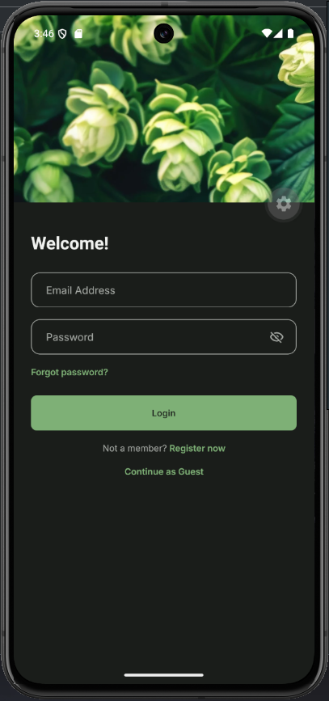
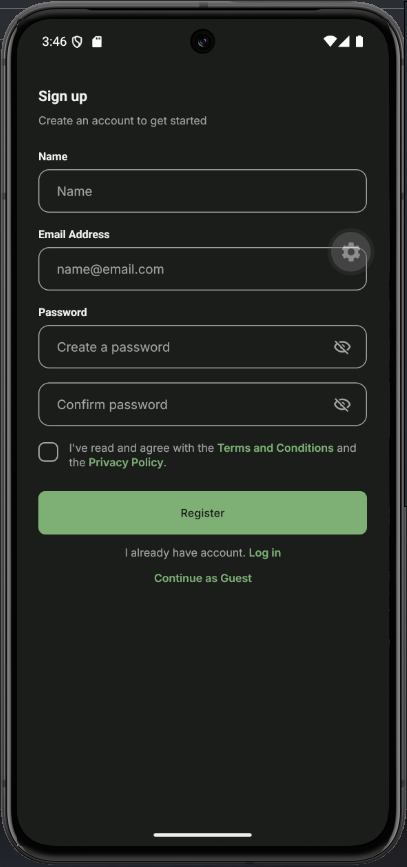
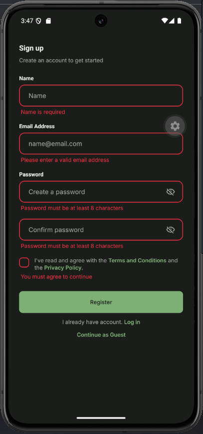
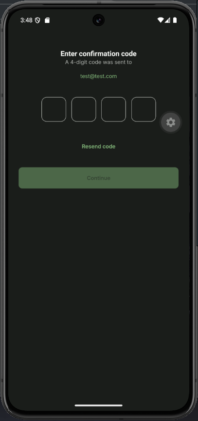 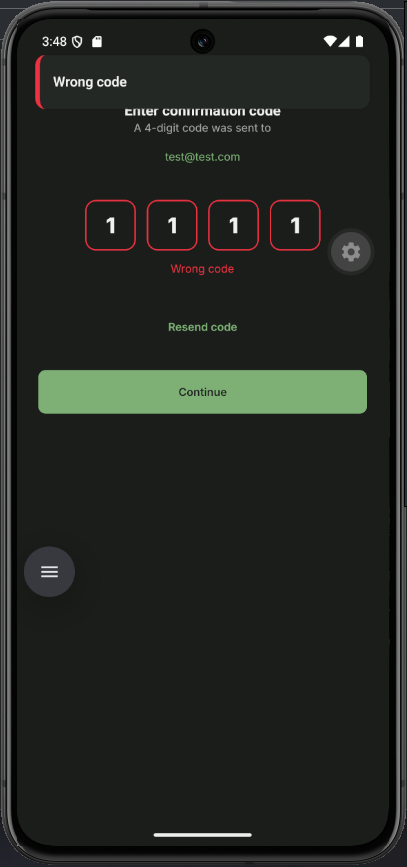
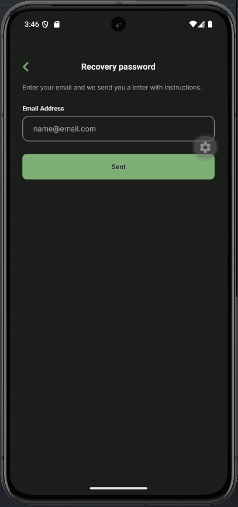

---

## Store (Product Catalog)

The product catalog underwent significant architectural and feature modernization:

- **Redux Toolkit Migration:** Catalog state management was transitioned to RTK, centralizing data
  flow, simplifying mutations, and streamlining access across components.
- **Sorting and Filtering:** Flexible controls to help users discover homebrewing ingredients and
  equipment, featuring category and price filters alongside sorting by price, rating, and
  popularity.
- **Full-Text Search:** Integrated search bar matching queries against both product names and
  detailed item descriptions.
- **Dynamic List Handling:** Implemented pull-to-refresh for instant updates and infinite scrolling
  for smooth pagination without excessive memory overhead.

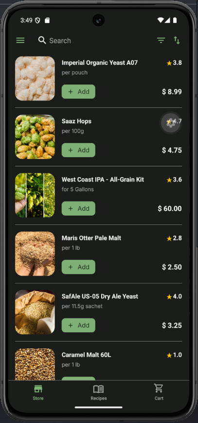 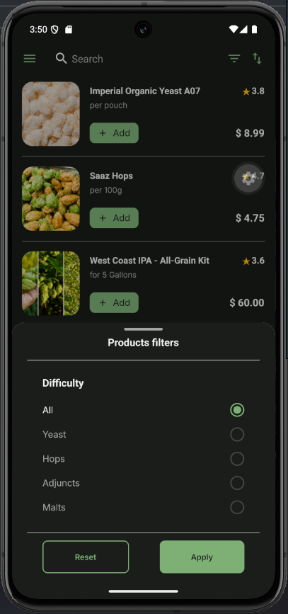
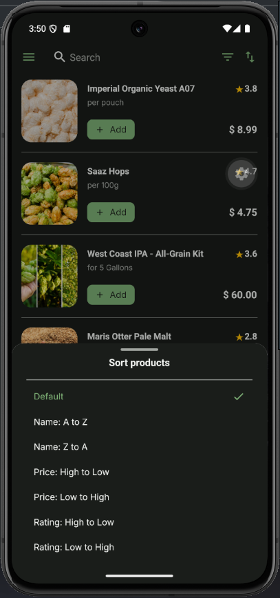 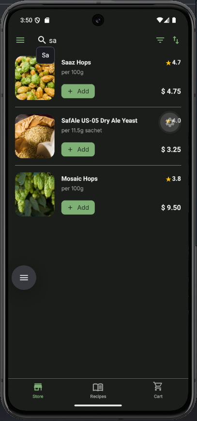
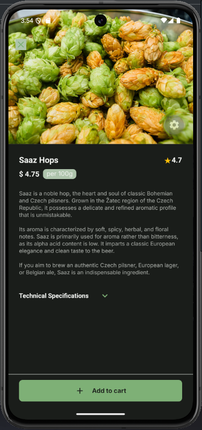 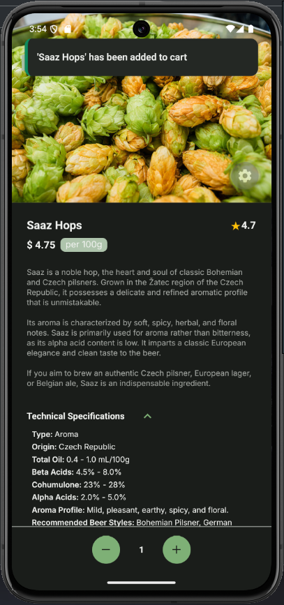

---

## Cart

The cart experience was optimized to ensure smooth checkout flows and continuous visibility over
selected items:

- **Interactive TabBar Badge:** The cart icon in the bottom TabBar displays a dynamic badge showing
  the total item count, visible from any main view.
- **Instant Visual Feedback:** Toast notifications confirm when items are successfully added
  (including ingredients imported from recipes) or removed.
- **Performance Optimization:** Cart calculations, total quantities, and storage synchronization
  logic were encapsulated into custom React hooks with memoization, eliminating unnecessary
  re-renders.

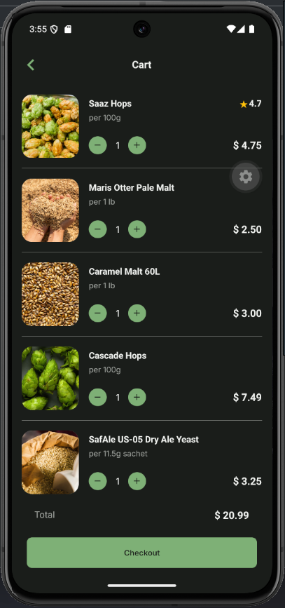 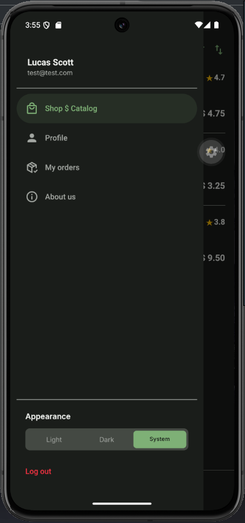
